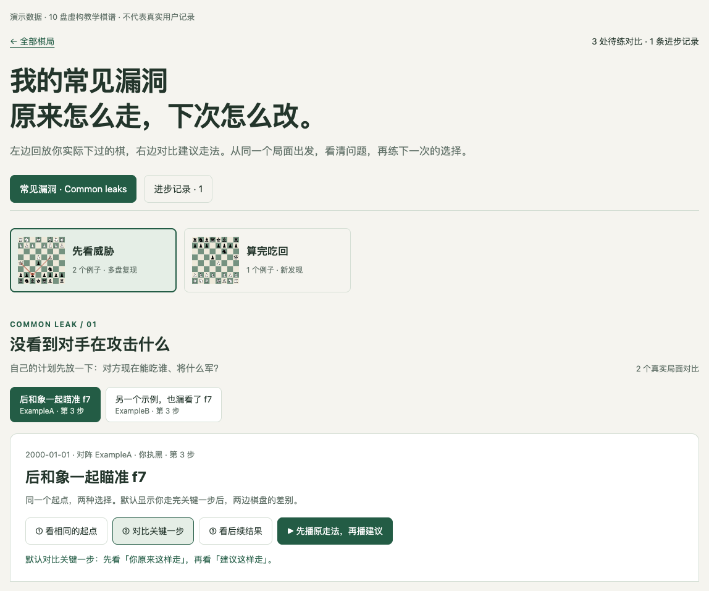
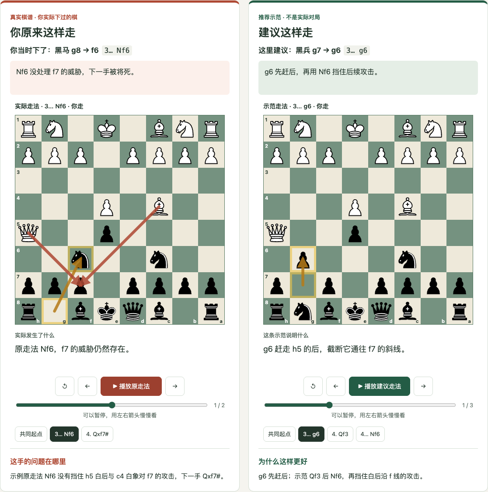
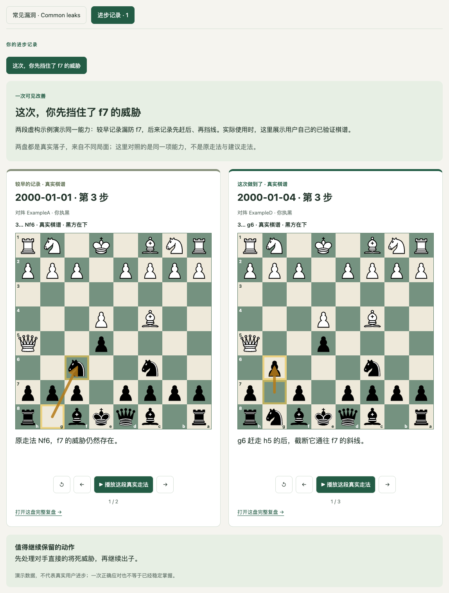

# Chess Review Open 2.0 · 国际象棋互动复盘技能

## Purpose

把你刚下完的一盘棋（PGN 棋谱）交给 AI 编程助手，几分钟后得到一个可以直接在浏览器里打开的**互动复盘网页**：哪一步走错了、当时应该怎么走、自己在棋盘上再试一次。中文讲解，离线可用，不需要注册任何网站。

适用于 Codex、Claude Code、Kimi 等支持 Agent Skills（`SKILL.md`）格式的 AI 助手。

## Changelog

| 版本 | 新增功能 | 你可以做什么 |
|---|---|---|
| 2.0 更新 | Chess.com 自动取谱 | 告诉助手用户名，以后直接说「复盘最新一盘」，无需复制粘贴或提供密码。其他平台仍支持 PGN。 |
| 2.0 更新 | Common leaks 跨局复盘 | 同一棋手完成至少 10 盘不同棋局的复盘后，找出重复失误，随新复盘补充案例和进步记录。 |

Chess Review plugin 包含两个 skill：**`chess-review-open`** 负责单盘复盘，**`chess-common-leaks`** 负责跨局漏洞分析。

## 一分钟安装

打开 **Codex 或其他 Coding Agent 桌面版**，新建一个对话，复制发送下面这句话：

```text
帮我安装这个仓库里的 Chess Review 插件和两个 skill，并配置好运行依赖：https://github.com/kevina0817-ctrl/chess-review-skill
```

安装完成后，就可以告诉助手你的 Chess.com 用户名，开始复盘。

## 怎么用

1. **告诉助手用户名。** 「我的 Chess.com 用户名是 YOUR_USERNAME，帮我复盘最新一盘。」助手会记住用户名，并自动判断你每盘执白还是执黑。
2. **以后直接说。** 「帮我 review 最新一盘」或「帮我复盘最近三盘」。使用其他平台，粘贴 PGN 并说明自己是哪一方即可。
3. **打开网页。** 复盘保存在 `chess-reviews/日期_对手.html`，所有棋局收进同一个 `index.html` 档案。
4. **积累后找漏洞。** 完成至少 10 盘复盘后，说「帮我整理 common leaks」。开启后，新复盘会自动补充到已有档案。

默认只复盘最新一盘；已复盘过则提供已有记录。Chess.com 公开棋谱可能延迟收录，未取到新棋时会说明。

## 功能展示

### 一、复盘

**先帮你把最关键的几步挑出来。** 一盘棋几十步，复盘会挑出值得停下来看、去练的关键局面：哪里开始偏离、哪一步丢子、哪里错过将死。

**关键复盘：实战走法 vs 改进走法。** 每一步都用一句话讲清楚为什么，棋盘上直接画出箭头，点一下就能对比当时的实际走法和更好的走法。


**自己试走。** 先不看答案，从真实局面出发自己走一步，网页会判断走法是否合法、是否就是更好的那一手，并给提示。


**整盘回放。** 逐步前进、后退或自动播放，随时翻转棋盘，下载 PGN 到其他软件继续研究。


**复盘档案。** 所有对局按日期收在同一个网页里，可以搜索对手、筛选执白执黑，每盘都能完整互动。


**手机也能看。** 单个 HTML 文件，发到手机上直接打开，没有网络也能用。


### 二、Common leaks 分析

**Common leaks：找到反复犯的错。** 把不同棋局里的同类失误放在一起，点击例子就能回到当时的局面。只出现一次标为「新发现」，至少两盘出现才标为「多盘复现」。



**原走法 vs 建议走法。** 两块棋盘从同一个局面出发，分别回放实际走法和建议变化。可以播放、暂停、逐步对照，配合箭头和短句看清问题与改法。



完成至少 **10 盘不同棋局的复盘**后，由你选择开启。每次新增复盘，旧问题补充案例，新问题加入档案；仅下载棋谱不计入门槛。

### 三、进步分析

**看见自己的进步。** 独立的「进步记录」标签保存真实好棋，有可比证据时展示前后变化；一次做对不会直接判定为已修复漏洞。



*Common leaks 和进步分析截图使用虚构教学棋谱，实际使用时展示你自己的对局。*

## 和其他复盘方式有什么不同

| | 直接和 ChatGPT 聊天（纯文字，未接棋类工具） | Chess.com / Lichess 等棋类软件 | Chess Review Open |
|---|---|---|---|
| 看懂问题 | 可以追问讲解，局面与变化主要靠文字理解。 | 在分析棋盘上看评分、变化和失误；部分功能提供教练解释。 | 挑出教学重点，用中文、箭头和原走法 / 建议走法对照讲清。 |
| 核对走法 | 仅凭文字回答，没有引擎或规则校验保证。 | 用棋类引擎分析局面。 | 脚本校验走法，关键局面用 Stockfish 核对，再由助手写讲解。 |
| 动手练习 | 可以讨论候选走法，纯文字聊天本身不是可操作棋盘。 | 可在分析棋盘试走，也有重试失误等练习功能。 | 从自己的关键局面试走，查看提示，并回放原走法与改进变化。 |

棋类软件本身也有讲解和练习，例如 [Chess.com Game Review](https://support.chess.com/en/articles/10328363-how-do-i-use-game-review-on-the-app) 和 [Lichess 的失误练习](https://lichess.org/page/blind-mode-tutorial)。本插件把**单盘教学、跨局漏洞和进步记录**整理进同一套可离线保存的互动档案，并允许继续修改讲解与模板。

### 复盘后，你能看清什么

| 你想知道什么 | 复盘里可以看到什么 |
|---|---|
| 当时哪里出了问题 | 具体棋子、格子、威胁与后果。 |
| 下次可以怎么走 | 从同一局面出发的建议变化，也能自己试走。 |
| 哪些错误反复出现 | 不同棋局的同类案例，放在一起回放。 |
| 最近有没有进步 | 真实好棋，以及有证据的前后变化。 |

## 它是怎么工作的

```
按 Chess.com 用户名取谱 / 你贴入 PGN → 脚本校验每一步是否合法
→ 内置 Stockfish 分析
→ AI 助手挑选教学重点并撰写中文讲解 → 生成单文件 HTML 并自动检查
→ 更新复盘档案 → 已开启 Common leaks 时，继续补充漏洞与进步记录
```

讲解由 AI 助手根据引擎结果撰写，不是引擎自动生成的文字。Stockfish 只在你电脑上分析时运行；生成的网页不需要引擎，也不联网。技能没有自己的服务器；AI 助手读取棋谱和生成讲解时，仍适用你使用的 AI 服务设置。

## 输入与输出

**输入：** Chess.com 用户名、PGN 文本、`.pgn` 文件或清晰棋谱截图。无法从用户名判断执子方时，说明你执白还是执黑。

**输出：** 默认保存在使用者电脑上的 `chess-reviews/` 文件夹里，生成可离线打开的 HTML 网页。不会自动上传到本插件仓库或作者的网站；需要部署时，由使用者另行指定并授权自己的托管目标。

- `日期_对手.html`：这盘棋的互动复盘网页。
- `日期_对手.pgn`：整理后的棋谱，可导入其他软件。
- `index.html`：所有对局的档案总入口，每次新增会自动更新。
- `common-leaks.html`：开启后持续更新的常见漏洞与进步档案。

网页里的个人笔记保存在当前浏览器中，可导出，不会自动跨设备同步。用户名和 Common leaks 偏好保存在本地配置中；个人棋谱不会作为插件示例提交，发布个人复盘网站需要另行授权。

## 目录

```text
plugins/chess-review/
  .codex-plugin/plugin.json
  skills/
    chess-review-open/    # 单盘复盘；共享脚本、模板与引擎
    chess-common-leaks/   # 跨局漏洞分析与增量更新
```

插件安装方式依所用助手而定。详见 [设计说明](docs/2.0-design.md) 和 [运行说明](plugins/chess-review/skills/chess-review-open/references/workflow.md)。

## 许可证

本项目自有的脚本、网页模板、文档和示例采用 [PolyForm Noncommercial 1.0.0](LICENSE)：任何人都可以免费使用、修改和分享，但**仅限非商业用途**（个人学习、爱好、教学、学校、非营利机构等）。商业用途请先联系 Mission Nine Lab Inc.（[info@mission9lab.com](mailto:info@mission9lab.com)）获得书面授权。

包里内置的 Stockfish 引擎、自动安装的 python-chess 以及棋子图形是第三方作品，保留它们各自的许可证，不受上述非商业限制。详见 [第三方说明](plugins/chess-review/skills/chess-review-open/NOTICE.md)。
