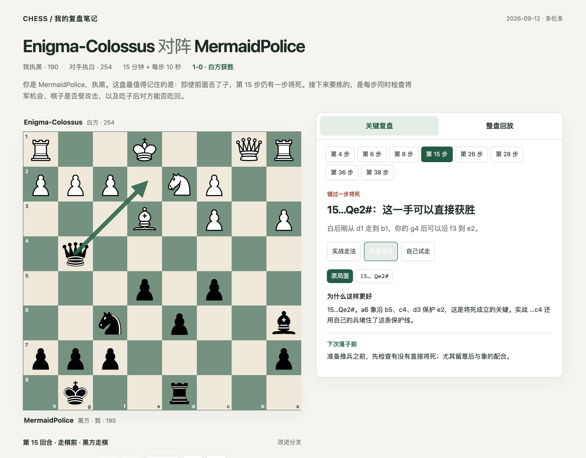
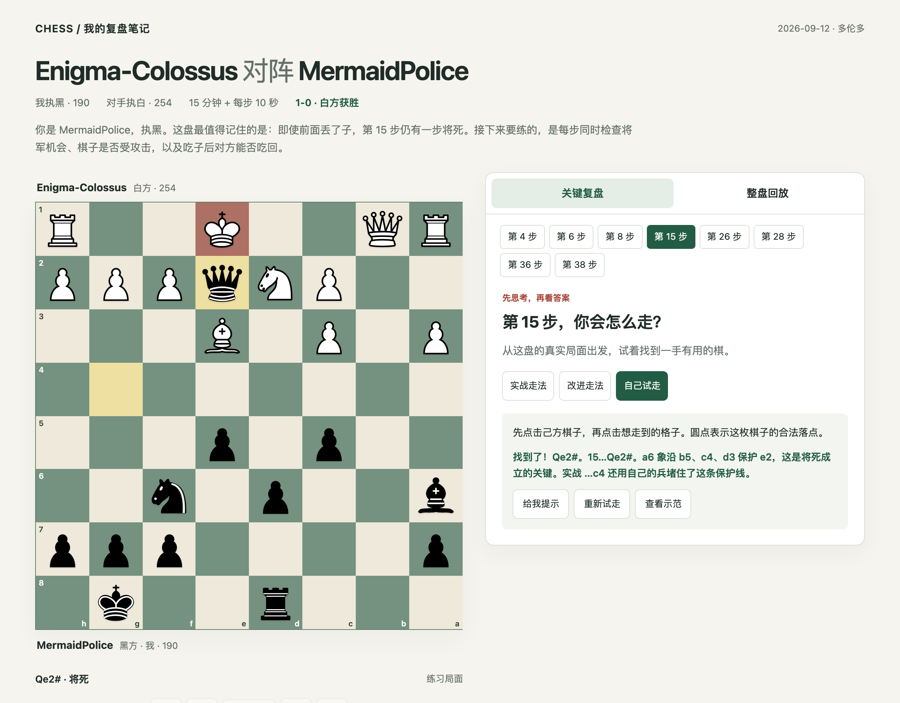
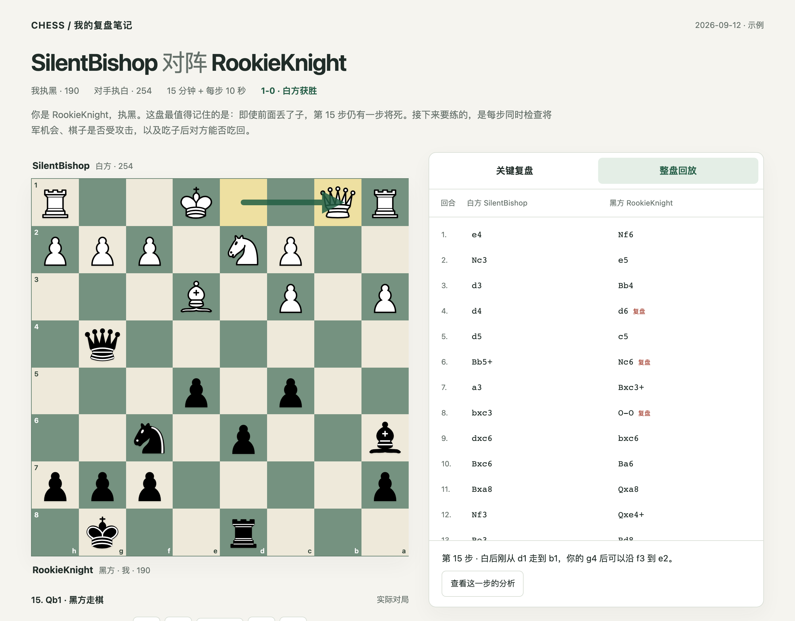
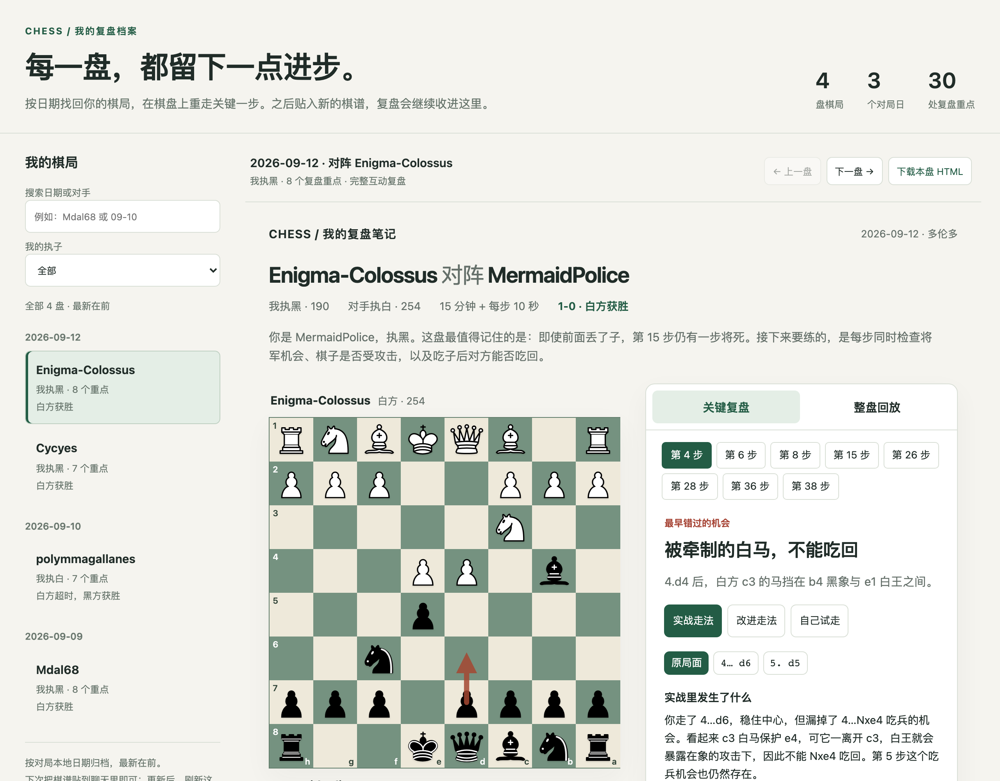
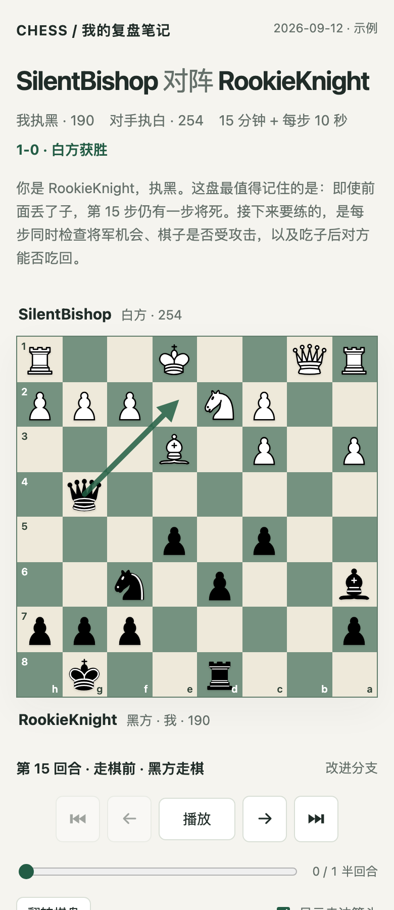

# Chess Review Open · 国际象棋互动复盘技能

把你刚下完的一盘棋（PGN 棋谱）交给 AI 编程助手，几分钟后得到一个可以直接在浏览器里打开的**互动复盘网页**：哪一步走错了、当时应该怎么走、自己在棋盘上再试一次。中文讲解，离线可用，不需要注册任何网站。

适用于 Codex、Claude Code、Kimi 等任何支持 Agent Skills（`SKILL.md`）格式的 AI 助手。

## 一分钟安装

打开终端，粘贴这一行回车，就会把整个技能（含棋类引擎）下载到当前文件夹：

```bash
git clone https://github.com/kevina0817-ctrl/chess-review-skill.git
```

或者在本页右上角点 **Code → Download ZIP**，下载后解压就可以了。

然后把里面的 `skills/chess-review-open` 文件夹放进你所用 AI 助手的技能目录（每个助手的目录位置不同，查看该助手关于 Skills 的说明即可）。也可以不安装：直接把整个仓库放在你的项目文件夹里，告诉助手「按照 `chess-review-skill/skills/chess-review-open/SKILL.md` 帮我复盘」。

电脑上需要有 Python 3.10 或更新版本。其他东西都不用再下载：Stockfish 棋类引擎已经打包在技能里，唯一的 Python 依赖包（python-chess）助手第一次运行时会按技能说明自动安装，也可以自己提前装好：

```bash
pip install chess
```

## 怎么用

1. **复制棋谱。** 在 Chess.com 打开你下完的对局，点「分享」→「PGN」复制；Lichess 在对局页面下方的「FEN & PGN」里复制。
2. **贴给助手，说明你执白还是执黑。** 例如：

   > 用 chess-review-open 帮我复盘这盘棋，我执黑。指出最关键的失误和更好的下法，生成互动网页。
   >
   > [Event "Live Chess"] ... 1. e4 Nf6 2. Nc3 e5 ...

3. **打开网页。** 助手会在你的项目里生成 `chess-reviews/日期_对手.html`，双击用浏览器打开就能用。以后每盘棋都会收进同一个 `chess-reviews/index.html` 档案里。

## 功能展示

**先帮你把最关键的几步挑出来。** 一盘棋几十步，真正决定胜负的往往只有那么几步。复盘会直接把这 4–8 步挑出来告诉你：最早在哪里开始偏离、第一次实际丢子是哪一步、哪一步本来可以一步将死。你一眼就知道，在这几步如果换个走法，结果会完全不一样。

这和传统的复盘软件不一样。传统软件需要你一步一步往下点，看着评分曲线上上下下，点到后面很容易失去焦点，也不知道该停在哪里。这里是反过来的：它先告诉你问题在哪里，你再针对这几步去看、去练。

**关键复盘：实战走法 vs 改进走法。** 每一步都用一句话讲清楚为什么，棋盘上直接画出箭头，点一下就能对比当时的实际走法和更好的走法。



**自己试走。** 先不看答案，从真实局面出发自己走一步，网页会判断走法是否合法、是否就是更好的那一手，并给提示。



**整盘回放。** 逐步前进、后退或自动播放，随时翻转棋盘，下载 PGN 到其他软件继续研究。



**复盘档案。** 所有对局按日期收在同一个网页里，可以搜索对手、筛选执白执黑，每盘都能完整互动。



**手机也能看。** 单个 HTML 文件，发到手机上直接打开，没有网络也能用。



## 和其他复盘方式有什么不同

| | 直接在聊天里问 AI | Chess.com / Lichess 的对局分析 | 本技能 |
|---|---|---|---|
| 讲解 | 只有文字，靠想象棋盘 | 引擎评分和「妙手 / 失误」标签，解释很少 | 针对你这一方的中文讲解，说清具体棋子、格子和后果 |
| 准确性 | AI 可能记错局面、编造走法 | 引擎准确 | 每个走法都经过规则校验，关键局面用 Stockfish 核对 |
| 练习 | 无 | 部分功能需付费 | 每个关键局面都能自己试走，免费 |
| 文件归属 | 留在聊天记录里 | 留在网站上 | 生成在你自己电脑里的 HTML，离线可用，可自由分享 |

## 它是怎么工作的

```
你贴入 PGN → 脚本校验每一步是否合法 → 内置 Stockfish 逐局面分析
→ AI 助手挑选教学重点并撰写中文讲解 → 生成单文件 HTML 并自动检查 → 更新复盘档案
```

讲解由 AI 助手根据引擎结果撰写，不是引擎自动生成的文字。Stockfish 只在你电脑上分析时运行；生成的网页不需要引擎，也不联网。技能没有服务器，不上传你的棋谱。

## 输入与输出

**输入：** 一盘棋的 PGN 棋谱文本，也就是像 `1. e4 e5 2. Nf3 Nc6 ...` 这样的着法记录，带不带 `[Event ...]` 这类头部信息都可以；也接受 `.pgn` 文件或清晰的棋谱截图。另外告诉助手你执白还是执黑（如果 PGN 里有你的用户名，助手会自动判断）。

**输出：** 三个文件，都在 `chess-reviews/` 文件夹里。

- `日期_对手.html`：这盘棋的互动复盘网页。
- `日期_对手.pgn`：整理后的棋谱，可导入其他软件。
- `index.html`：所有对局的档案总入口，每次新增会自动更新。

网页里的个人笔记保存在当前浏览器中，可导出，不会自动上传。

## 目录

- `skills/chess-review-open/SKILL.md`：助手的工作流程。
- `scripts/`：棋谱校验、引擎调用、网页构建及浏览器检查。
- `assets/`：单盘和总入口的 HTML 模板。
- `vendor/stockfish/`：内置的官方 Stockfish 19（macOS、Windows、Linux）。
- `references/`：运行说明与复盘数据格式。
- `examples/`：两个虚构的教学样例，用来检查模板。

## 许可证

装好这个包就可以直接用，不需要再单独下载任何东西。

本项目自有的脚本、网页模板、文档和示例采用 [PolyForm Noncommercial 1.0.0](LICENSE)：任何人都可以免费使用、修改和分享，但**仅限非商业用途**（个人学习、爱好、教学、学校、非营利机构等）。商业用途请先联系 Mission Nine Lab Inc.（[info@mission9lab.com](mailto:info@mission9lab.com)）获得书面授权。

包里内置的 Stockfish 引擎、自动安装的 python-chess 以及棋子图形是第三方作品，保留它们各自的许可证，不受上述非商业限制。详见 [第三方说明](skills/chess-review-open/NOTICE.md)。
